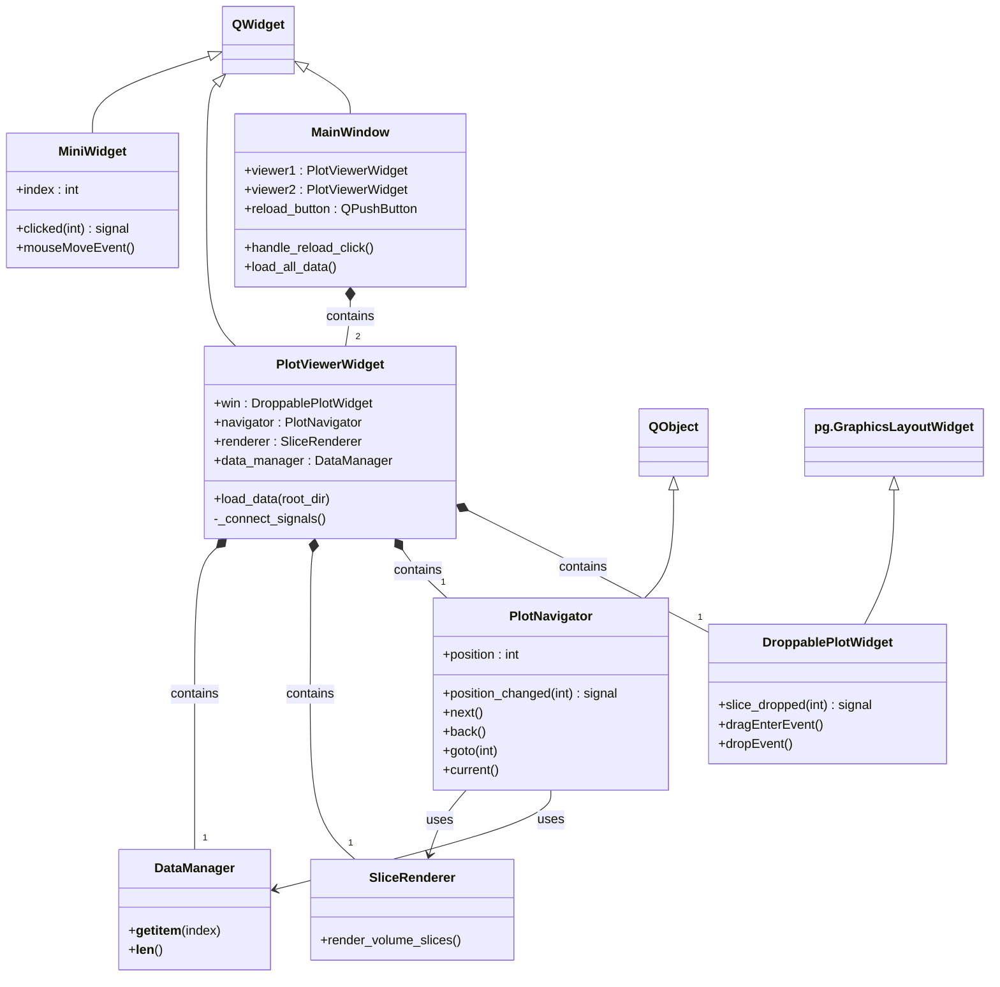
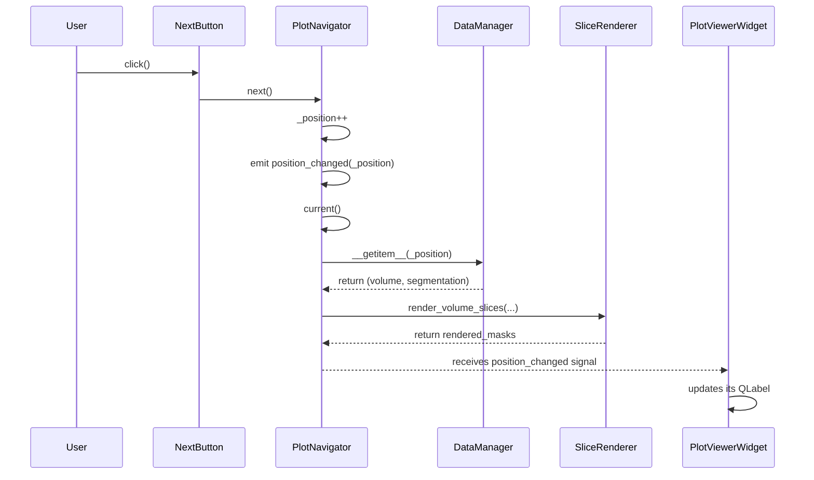
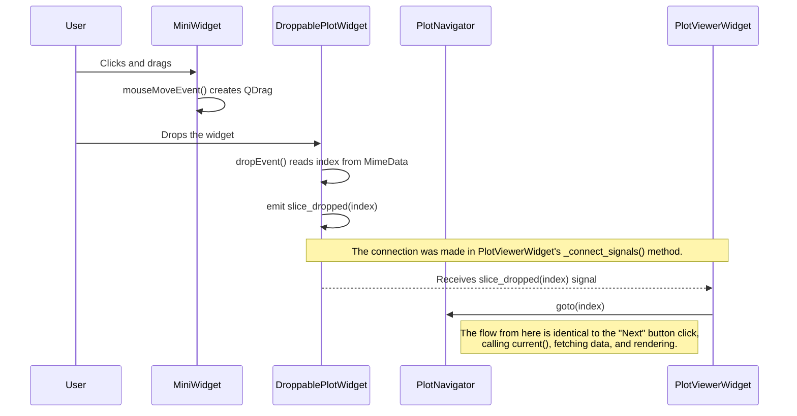

# Application Architecture Document

## 1. Introduction

This document outlines the software architecture of the PyQt Dual Volume Viewer application. The primary goal of this design is to create a modular, scalable, and maintainable application by leveraging object-oriented principles and Qt's powerful signal and slot mechanism.

The application allows a user to view two medical imaging volumes side-by-side, navigate through their cases, and interact with the displayed slices via a drag-and-drop interface.

## 2. Core Components (Class Overview)

The application is broken down into several key classes, each with a specific responsibility.

*   **`MainWindow`**: The top-level QWidget that orchestrates the entire application. It assembles the main UI components and manages the application-wide state, such as the current patient's data directory.
*   **`PlotViewerWidget`**: A composite QWidget that encapsulates a single, complete viewing pane. It contains the plot, control buttons, and its own data navigator. This modularity allows for easy creation of multiple, independent viewers.
*   **`PlotNavigator`**: A QObject responsible for managing the navigation state (e.g., current index) for a single `PlotViewerWidget`. It handles the logic for `next()`, `back()`, and `goto()` operations.
*   **`SliceRenderer`**: A class that handles the rendering logic. It takes raw volume and segmentation data and uses `pyqtgraph` to create and display the final image items.
*   **`DataManager`**: This class is the data abstraction layer. It is responsible for finding, loading, and providing access to the NRRD data files from the disk.
*   **`DroppablePlotWidget`**: A specialized `pyqtgraph.GraphicsLayoutWidget` that is enhanced to accept drag-and-drop events, specifically for receiving a slice index.
*   **`MiniWidget`**: A simple, draggable QWidget that represents a single data case in the manifest list. It holds an index and initiates a drag-and-drop operation.

## 3. UML Class Diagram

This diagram illustrates the relationships between the major classes in the application.

*   **Composition (`◆--`):** An object is composed of other objects. For example, `MainWindow` is composed of two `PlotViewerWidget`s. The component cannot exist without the container.
*   **Inheritance (`<|--`):** A class inherits from a base class. For example, `DroppablePlotWidget` inherits from `pg.GraphicsLayoutWidget`.
*   **Association (`-->`):** An object has a reference to another object. For example, `PlotNavigator` has a reference to a `DataManager`.

## 4. Signal and Slot Interaction Flow

The application is event-driven, relying on Qt's signal and slot mechanism for communication between objects. This decouples the components and makes the system highly responsive. Below are sequence diagrams for key user interactions.

### 4.1. User Clicks the "Next" Button

This diagram shows how a simple button click in one viewer propagates through the system to update its display.

### 4.2. User Drags and Drops a `MiniWidget`

This is a more complex interaction that demonstrates how signals chain together across multiple, independent components to achieve a result.

## 5. Data Flow

The flow of data from disk to screen is managed by a clear chain of responsibility:

1.  **`MainWindow`** determines the patient's root directory (`root_dir`).
2.  This `root_dir` is passed to `PlotViewerWidget.load_data()`.
3.  The `PlotViewerWidget` instantiates a **`DataManager`** with the `root_dir`. The `DataManager` scans the filesystem and creates a manifest of all available volume/segmentation pairs.
4.  When the **`PlotNavigator`** needs to display a slice (e.g., in its `current()` method), it asks the `DataManager` for the data at its current `_position`: `data_manager[self._position]`.
5.  The `DataManager` loads the specific NRRD files from disk and returns the raw NumPy arrays for the volume and segmentation.
6.  The `PlotNavigator` passes these NumPy arrays to the **`SliceRenderer`**.
7.  The `SliceRenderer` processes the arrays, creates `pyqtgraph.ImageItem` objects, and adds them to the `DroppablePlotWidget` for display.

This ensures that data loading is done on-demand and that the rendering logic is cleanly separated from the data management and navigation state.
