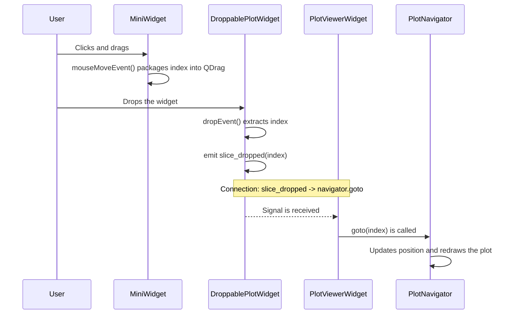

# Drag-and-Drop Interaction

The drag-and-drop functionality is a key feature of the application, allowing the user to intuitively navigate to a specific data slice by dragging it from the manifest list onto a plot. This interaction is a coordinated effort between three distinct classes.

## 1. The Components

1.  **`MiniWidget` (The Drag Source)**
    *   **Role**: To represent a single, draggable item in the manifest list.
    *   **Key Attribute**: `self.index`, an integer that identifies which data slice it corresponds to.

2.  **`DroppablePlotWidget` (The Drop Target)**
    *   **Role**: To be the area that can receive the drop.
    *   **Key Feature**: It's a subclass of `pg.GraphicsLayoutWidget` with drag-and-drop events enabled and implemented.

3.  **`PlotViewerWidget` (The Coordinator)**
    *   **Role**: To connect the *result* of the drop (the index) to the *action* of navigating the data. It acts as the glue between the UI event and the application logic.

## 2. The Sequence of Events

The entire process can be broken down into a clear sequence, from the initial mouse press to the final plot update.

### Step 1: Initiating the Drag (`MiniWidget`)

1.  **`mousePressEvent`**: When the user clicks the left mouse button on a `MiniWidget`, the widget simply records the starting position of the mouse cursor. It does *not* treat this as a click yet.
2.  **`mouseMoveEvent`**: As the user moves the mouse while holding the button down, this event is continuously fired.
    *   The widget first checks if the distance moved is significant (more than a few pixels). This prevents accidental, tiny mouse jitters from being interpreted as a drag.
    *   If the movement is large enough, it concludes that a drag has started.
    *   It creates a `QDrag` object, which is the main object for managing a drag-and-drop operation.
    *   It creates a `QMimeData` object. This is a generic container for carrying data. In our case, we use `mime_data.setText(str(self.index))` to package the widget's index into the container as a string.
    *   The `QMimeData` is attached to the `QDrag` object.
    *   `drag.exec_()` is called. This is a **blocking call** that starts the drag operation and transfers control to Qt's drag-and-drop system. The `MiniWidget`'s code pauses here until the drop is completed or canceled.

### Step 2: Receiving the Drop (`DroppablePlotWidget`)

1.  **`dragEnterEvent`**: As the user's cursor (now carrying the drag object) enters the boundaries of the `DroppablePlotWidget`, this event is triggered.
    *   The widget inspects the incoming data package: `event.mimeData().hasText()`.
    *   If the package contains text (which ours does), it calls `event.acceptProposedAction()`. This tells the system, "Yes, I am a valid target for this type of data," and the cursor typically changes to indicate that a drop is possible.
    *   If it contained a different data type (e.g., a file), we could call `event.ignore()`.

2.  **`dropEvent`**: When the user releases the mouse button over the widget, this is the final and most important event.
    *   The widget again checks the data, opens the package, and retrieves the index string using `event.mimeData().text()`.
    *   It converts the string back into an integer: `slice_index = int(...)`.
    *   It then emits its own custom signal: **`self.slice_dropped.emit(slice_index)`**. This is the crucial handoff. The `DroppablePlotWidget`'s job is now done. It has successfully received the index and is now broadcasting it to any other part of the application that is listening.

### Step 3: Handling the Result (`PlotViewerWidget`)

The `PlotViewerWidget` is the component that listens for the signal emitted by its `DroppablePlotWidget`. The connection is made in its `_connect_signals` method:

```python
# In PlotViewerWidget._connect_signals
self.win.slice_dropped.connect(self.navigator.goto)
```

1.  When `slice_dropped` is emitted with the index, the `self.navigator.goto` method (slot) is automatically called with that index as its argument.
2.  The `PlotNavigator`'s `goto` method updates its internal position, loads the corresponding data from the `DataManager`, tells the `SliceRenderer` to display it, and emits its own `position_changed` signal to update the UI label.

## 3. Sequence Diagram


